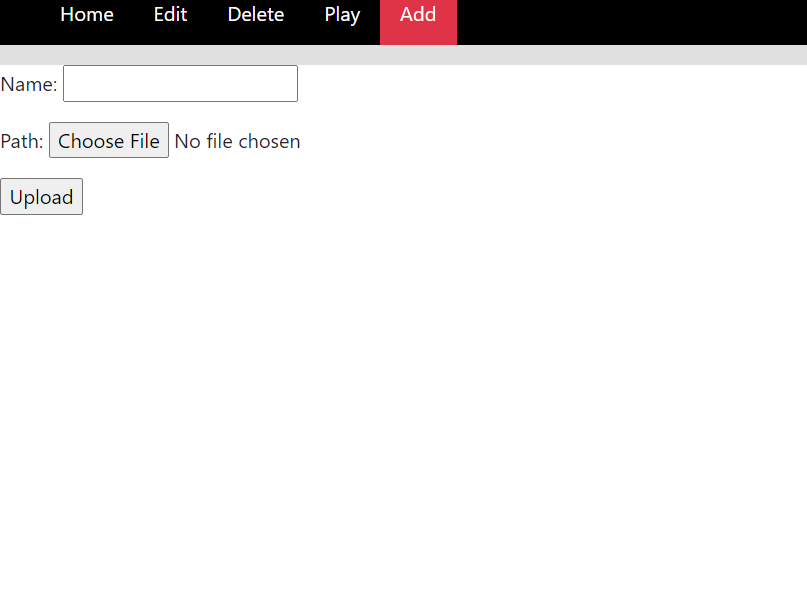
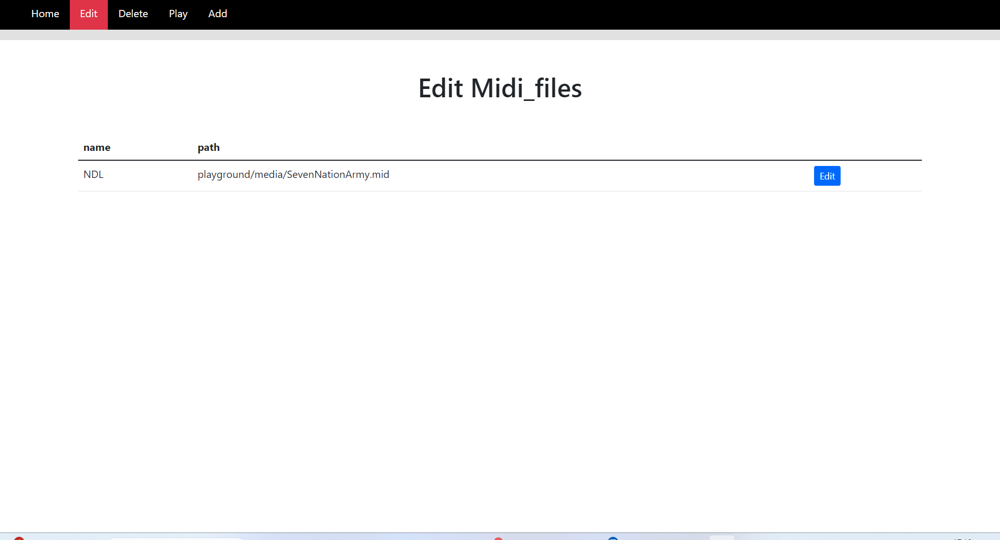
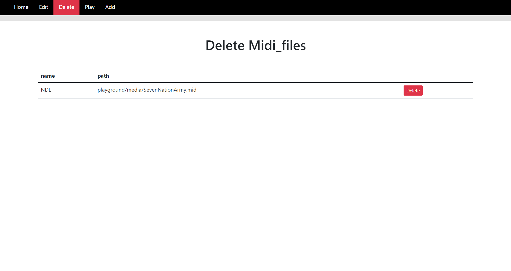
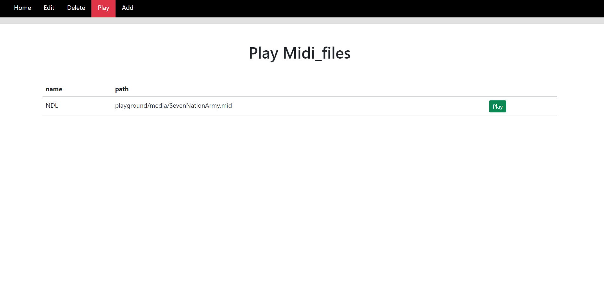

# Self-Playing Guitar

Welcome to the repository of the **Self-Playing Guitar** project. 
Our application is a website build in [Django](https://www.djangoproject.com/) that allow its user to add, edit, delete and play files.

## 💡 Table of content

  1. [🏁 Features](#-features)
  2. [🔍 Overview](#-overview)
  3. [🚀 Setup](#-setup)
  4. [💾 Database](#-database)
  5. [💛 Contributors](#-contributors)

## 🏁 Features

List of features implemented and in development:
- [x] Adding files to the Database
- [x] Editing files in the Database
- [x] Deleting files in the Database
- [x] Playing files from the Database on the guitar


## 🔍 Overview
The website has four distinct pages, one for each feature seperately. 

There is a page to add files to the database. 

Here the user can upload a midi file of a song to the database.

A page to edit files.

Here the user can edit a file in the database.

A page to delete files.

On this page the user can delete files that are in the database.

And a page to play files.

Here the user can choose one of the files in the database to play on the guitar.

The user can switch between pages by clicking the buttons in the navigation bar on top of the page.

## 🚀 Setup

To lauch the website on your device, you can copy this repository on your raspberriPi:

```bash
cd pidjango
source djenv/bin/activate
cd pidjango
python manage.py runserver 192.168.233.233:8000
```
To install the necessery libraries if needed you can use the following commands on your raspberriPi:
```bash
sudo apt install libapache2-mod-wsgi-py3
sudo a2enmod wsgi
sudo apt install python3 python3-venv python3-pip
sudo nano /etc/apache2/sites-enabled/000-default.conf
sudo systemctl restart apache2
python3 -m pip install django
python3 -m install mido
python3 -m install time
```

## 💾 Database

The database used to store the data of the schedule is [sqlite3](https://www.sqlite.org/index.html).  
In a django project sqlite3 is the default database. The models included in the database are designed in the `playground/model.py` file. Please see the [Django model documentation](https://docs.djangoproject.com/en/4.2/topics/db/models/) for more information. 

## 💛 Contributors

[](https://gitlab.science.ru.nl/kvoigtlaender)
[](https://gitlab.science.ru.nl/kquillettes)
